# Category Performance Analysis

## Algorithm and Data Structure Optimization

| | |
|---|---|
| 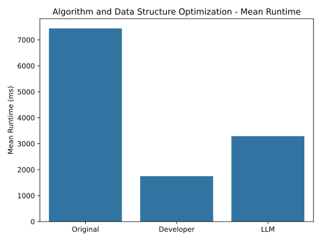 | 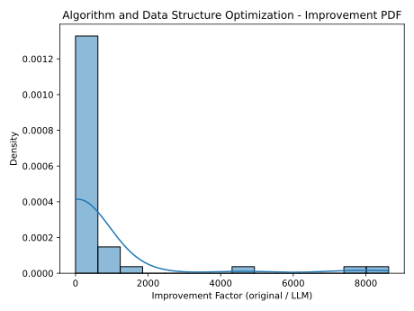 |
| 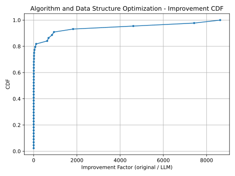 | 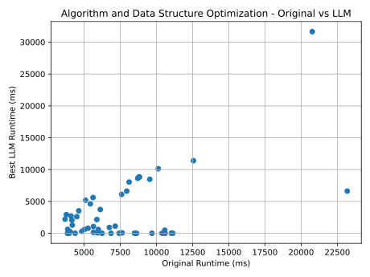 |

## Domain-specific and I_O Optimization

| | |
|---|---|
| 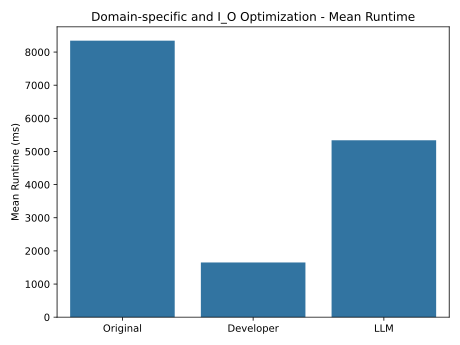 | 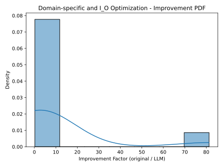 |
| 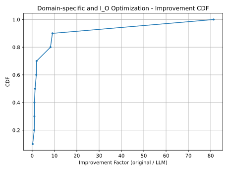 | 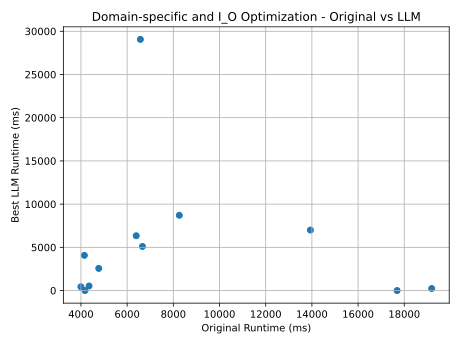 |

## Memory Optimization

| | |
|---|---|
| 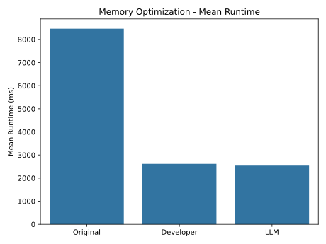 | 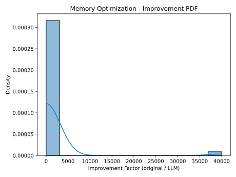 |
| 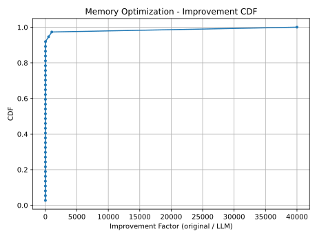 | 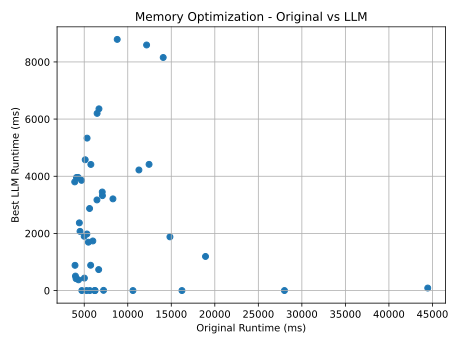 |

## Parallelism and Vectorization

| | |
|---|---|
| 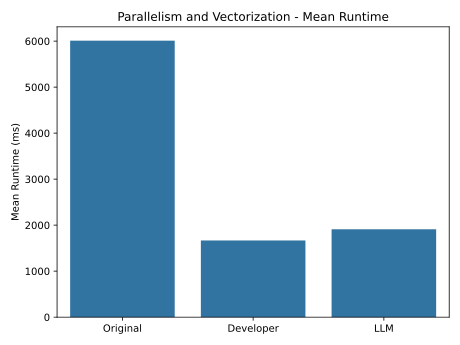 | 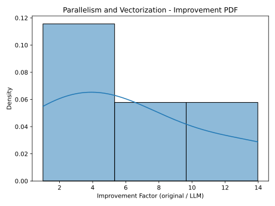 |
| 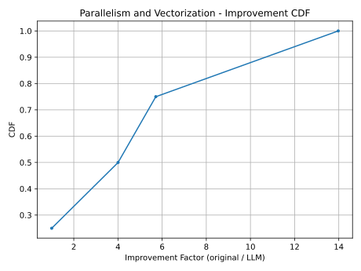 | 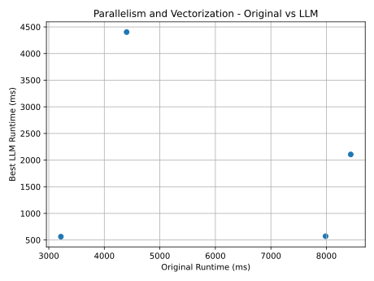 |

## Redundant Computation

| | |
|---|---|
| 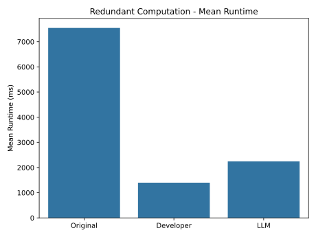 | 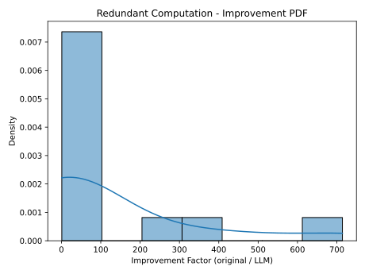 |
| 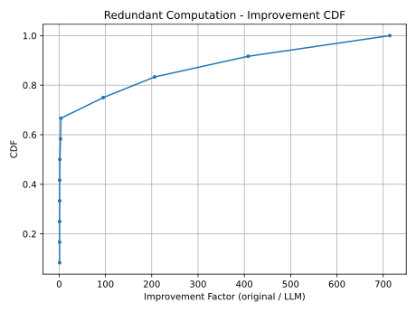 | 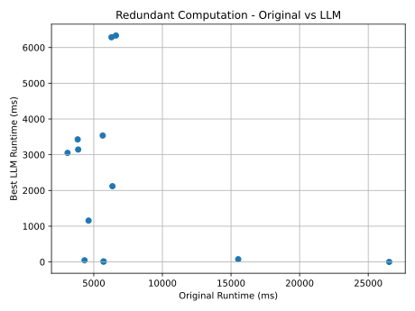 |

## misc

| | |
|---|---|
| 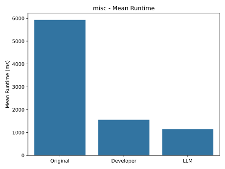 | 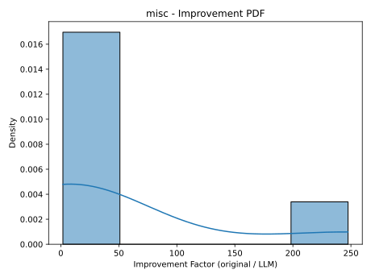 |
| 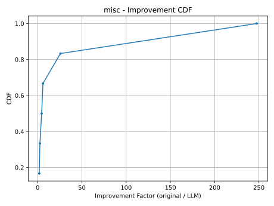 | 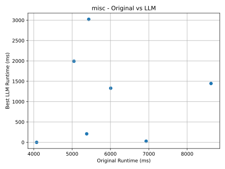 |

